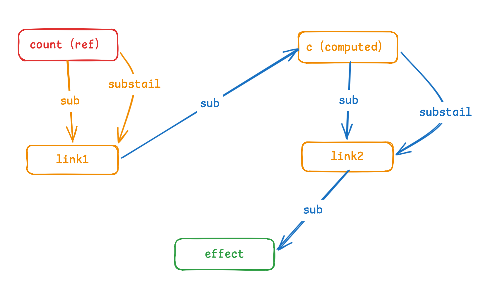

# 实现原理
computed其实他是一个sub也是一个dep如下如图所示



``` js
const count = ref(100)
const doubleCount = computed(() => {
    return count.value * 0
})

effect(() => {
    console.count("effect");
    doubleCount.value
})

setTimeout(() => {
    // 此时会沿着link1上的sub找到computed，然后computed会执行update（和effect是一样的），然后再找通过sub找到link2上的sub从而找到effect重新执行（和ref一样）
    count.value = 1000
}, 1000)
```
# 缓存的机制

## 第一种 脏的标识
``` js 
// 如下代码，如果不在computed中加上是不是脏的标识
// 则会执行两次, 每调用一次就会执行一次

// 如果加上了是不是脏的标识，那么就会执行一次
computedCount.value
computedCount.value
```

## 第二种 computed有没有被effect收集

如果是如下所示就没必要进行触发update了
``` js
const count = ref(100)
const doubleCount = computed(() => {
    return count.value * 0
})

setTimeout(() => {
    count.value = 1000
}, 1000)
```

## 第三种 computed的结果是不是没变

如下所示那么effect不会重新执行
``` js
const count = ref(100)
const doubleCount = computed(() => {
    return count.value * 0
})

effect(() => {
    console.count("effect");
    doubleCount.value
})

setTimeout(() => {
    count.value = 1000
}, 1000)
```